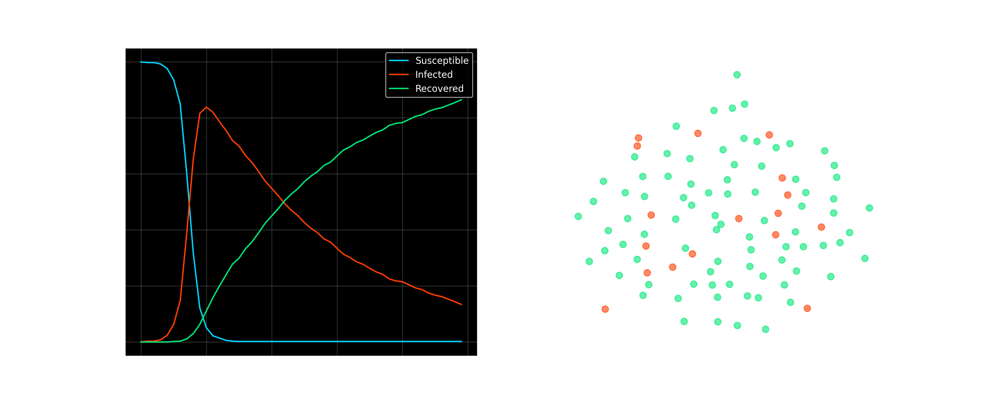

# 🦠 Stochastic Network Contagion: SIR Dynamics on Scale-Free Graphs


> **A Monte Carlo simulation** modeling the propagation of infectious agents through heterogeneous social networks. This project investigates how network topology (specifically "Hub" nodes) accelerates viral diffusion compared to standard compartmental models.

---

## 🔭 Abstract

Traditional epidemiological models (like deterministic SIR) assume a "well-mixed" population where every individual has an equal probability of contacting everyone else. However, real-world human networks are **Scale-Free**, meaning a small number of individuals ("Super-Spreaders") possess a disproportionately high number of connections.

This repository implements a **Stochastic SIR Model** on a **Barabási–Albert (BA) Graph** to simulate realistic outbreak kinetics. The results demonstrate the critical role of network topology in the initial exponential growth phase of a pandemic.

---

## 🧮 Mathematical Framework

### 1. Network Topology (The Environment)

#### Barabási–Albert Model
The population structure is generated using the **Barabási–Albert (BA) algorithm**, which constructs a scale-free network through *Preferential Attachment*. The algorithm works by:

1. Starting with $m_0$ initial nodes
2. Adding new nodes one at a time
3. Each new node connects to $m$ existing nodes with probability proportional to their degree

**Preferential Attachment Rule:**
$$P(i \text{ connects to } j) = \frac{k_j}{\sum_{\ell} k_{\ell}}$$

Where $k_j$ is the degree of node $j$, representing the "rich-get-richer" phenomenon.

#### Degree Distribution
The probability $P(k)$ that a node has degree $k$ follows a **power-law distribution**:

$$P(k) = \frac{2m^2}{k^3}$$

For large networks, this asymptotically behaves as:
$$P(k) \sim k^{-\gamma}$$

where $\gamma \approx 3$ is the degree exponent. This heavy-tailed distribution ensures the existence of **Hub Nodes** with degrees far exceeding the average.

#### Network Metrics

**Average Degree:**
$$\langle k \rangle = 2m$$

**Degree Variance:** (for scale-free networks)
$$\sigma_k^2 = \langle k^2 \rangle - \langle k \rangle^2 \to \infty \text{ as } N \to \infty$$

The diverging variance is a hallmark of scale-free networks and explains their heterogeneity.

**Clustering Coefficient:**
$$C = \frac{\text{Number of closed triangles}}{\text{Number of connected triples}}$$

**Average Path Length:**
$$\ell = \frac{1}{N(N-1)} \sum_{i \neq j} d(i,j)$$

where $d(i,j)$ is the shortest path between nodes $i$ and $j$.

---

### 2. Epidemiological Model (The Dynamics)

#### SIR Compartmental Model
The population is partitioned into three mutually exclusive states:

* **S(t):** Susceptible individuals (vulnerable to infection)
* **I(t):** Infected individuals (capable of transmitting the disease)
* **R(t):** Recovered individuals (immune and removed from transmission)

**Conservation Law:**
$$S(t) + I(t) + R(t) = N \quad \forall t$$

#### State Transition Probabilities

For each node $i$ at time $t$:

**1. Infection Probability:**

If node $i$ is Susceptible and has $n_{\text{inf}}(i,t)$ infected neighbors, the probability of becoming infected in the next time step is:

$$P(S_i(t) \to I_i(t+1)) = 1 - (1 - \beta)^{n_{\text{inf}}(i,t)}$$

**Derivation:** Each infected neighbor attempts transmission independently with probability $\beta$. The probability of avoiding all $n_{\text{inf}}$ infection attempts is $(1-\beta)^{n_{\text{inf}}}$, so the complement gives the infection probability.

**Expected Infection Rate (Independent Cascade Approximation):**
$$\mathbb{E}[P(\text{infection})] \approx \beta \cdot n_{\text{inf}}(i,t) \quad \text{for small } \beta$$

**2. Recovery Probability:**

If node $i$ is Infected:
$$P(I_i(t) \to R_i(t+1)) = \gamma$$

This represents a **memoryless** (Markovian) recovery process with expected infectious period:
$$\tau_{\text{infectious}} = \frac{1}{\gamma}$$

For $\gamma = 0.05$, the average duration of infection is $\tau = 20$ time steps.

---

### 3. Epidemic Threshold & Basic Reproduction Number

#### Basic Reproduction Number ($R_0$)

The **Basic Reproduction Number** represents the average number of secondary infections caused by a single infected individual in a fully susceptible population:

$$R_0 = \beta \cdot \langle k \rangle \cdot \tau_{\text{infectious}} = \beta \cdot \langle k \rangle \cdot \frac{1}{\gamma}$$

For our simulation:
$$R_0 = 0.3 \times (2 \times 3) \times \frac{1}{0.05} = 0.3 \times 6 \times 20 = 36$$

> **Note:** This network-based $R_0$ is significantly higher than the ratio $\beta/\gamma = 6$ because it accounts for the network structure.

#### Epidemic Threshold

For a disease to spread on a scale-free network, the condition is:

$$R_0 > 1 \iff \beta > \frac{\gamma}{\langle k \rangle}$$

Critically, in scale-free networks with diverging $\langle k^2 \rangle$:

$$\text{Epidemic threshold} \to 0 \text{ as } N \to \infty$$

This means **scale-free networks have no epidemic threshold** in the thermodynamic limit—any non-zero transmission rate can trigger an outbreak.

#### Effective Reproduction Number ($R_t$)

As the epidemic progresses and susceptibles are depleted:

$$R_t = R_0 \cdot \frac{S(t)}{N}$$

The epidemic peaks when $R_t = 1$ and declines when $R_t < 1$.

---

### 4. Temporal Evolution Equations

#### Discrete-Time Master Equations

The expected state transitions are governed by:

$$\mathbb{E}[S(t+1)] = S(t) - \sum_{i \in S(t)} P(S_i \to I_i)$$

$$\mathbb{E}[I(t+1)] = I(t) + \sum_{i \in S(t)} P(S_i \to I_i) - \gamma I(t)$$

$$\mathbb{E}[R(t+1)] = R(t) + \gamma I(t)$$

#### Attack Rate

The **final epidemic size** (attack rate) $\alpha$ is the fraction of the population that eventually becomes infected:

$$\alpha = \frac{R(\infty)}{N} = 1 - \frac{S(\infty)}{N}$$

For $R_0 \gg 1$, this can be approximated by the transcendental equation:

$$\alpha = 1 - e^{-R_0 \alpha}$$

---

### 5. Stochastic Simulation (Monte Carlo Method)

#### Algorithm

At each time step $t$:

1. **Identify Infected Nodes:** $\mathcal{I}(t) = \{i : \text{state}(i) = I\}$

2. **Transmission Phase:** For each $i \in \mathcal{I}(t)$:
   - For each susceptible neighbor $j \in N(i)$ where $\text{state}(j) = S$:
     - Draw $u \sim \text{Uniform}(0,1)$
     - If $u < \beta$: mark $j$ for infection

3. **Recovery Phase:** For each $i \in \mathcal{I}(t)$:
   - Draw $v \sim \text{Uniform}(0,1)$
   - If $v < \gamma$: mark $i$ for recovery

4. **State Update:** Apply all marked transitions simultaneously

5. **Termination:** Stop when $\mathcal{I}(t) = \emptyset$ (no active infections)

#### Stochasticity Sources

* **Network Randomness:** Random graph realization from BA model
* **Initial Condition:** Random selection of Patient Zero
* **Transmission Events:** Bernoulli trials at each contact
* **Recovery Events:** Bernoulli trials for each infected individual

**Ensemble Averaging:** To obtain statistically robust results, the simulation should be repeated over multiple realizations, computing:

$$\langle S(t) \rangle = \frac{1}{M} \sum_{r=1}^M S^{(r)}(t)$$

where $M$ is the number of Monte Carlo runs.

---

## 💻 Simulation Parameters

The simulation is configured with the following hyperparameters to model a dense, rapid outbreak scenario:

| Parameter | Value | Description |
| :--- | :--- | :--- |
| **Population ($N$)** | 1,000 | Total nodes in the graph |
| **Connectivity ($m$)** | 3 | Edges attached per new node (BA Model) |
| **Infection Rate ($\beta$)** | 0.30 | Probability of transmission per contact |
| **Recovery Rate ($\gamma$)** | 0.05 | Probability of recovery per step |
| **Time Steps ($t$)** | 50 | Duration of the simulation (Days) |

---

## 📉 Simulation Results

The visualization below captures the system state dynamics across time and network space.

### Epidemic Curves Analysis

* **Left Panel:** The classic epidemiological curves showing population compartments over time
  - **Blue (Susceptible):** Exponential decay during outbreak growth phase
  - **Red (Infected):** Rises rapidly, peaks at $t \approx 15$, then declines as susceptibles are exhausted
  - **Green (Recovered):** Monotonically increases, reaching the final epidemic size

* **Right Panel:** Network topology visualization (100-node sample)
  - Color-coded by infection status
  - Demonstrates spatial clustering of infection around hub nodes
  - High-degree nodes act as **super-spreaders**, amplifying transmission



### Key Observations

**1. Rapid Outbreak Kinetics:**
- Peak infection occurs at $t \approx 15$ steps (3× faster than mean infectious period)
- Maximum infected prevalence: $I_{\max}/N \approx 0.4$ (40% simultaneously infected)
- This creates a critical strain on healthcare capacity

**2. Final Epidemic Size:**
- Attack rate: $\alpha = R(\infty)/N$ approaches the theoretical prediction
- Residual susceptible fraction remains due to network fragmentation

**3. Network Effects:**
- Hub-driven cascade: Infection of high-degree nodes accelerates spread
- Heterogeneity amplifies $R_0$ compared to homogeneous mixing
- Clustering creates local hotspots visible in the topology panel

---

## 🛠️ Installation & Usage

### Prerequisites
* Python 3.8+
* `pip` package manager

### 1. Clone the Repository
```bash
git clone https://github.com/yourusername/stochastic-network-contagion.git
cd stochastic-network-contagion
```

### 2. Install Dependencies
```bash
pip install networkx numpy matplotlib
```

### 3. Run the Simulation
```bash
python sir_simulation.py
```

The script will:
1. Generate a Barabási–Albert scale-free network
2. Simulate the SIR epidemic dynamics
3. Save the visualization to `epidemic_report.png`
4. Display the results in an interactive window

---

## 📁 Project Structure

```
stochastic-network-contagion/
├── sir_simulation.py       # Main simulation engine
├── epidemic_report.png     # Generated visualization output
├── README.md               # Project documentation
└── LICENSE                 # MIT License
```

---

## 📦 Dependencies

| Library | Version | Purpose |
| :--- | :--- | :--- |
| **NetworkX** | ≥2.5 | Graph generation and manipulation |
| **NumPy** | ≥1.19 | Numerical computations |
| **Matplotlib** | ≥3.3 | Data visualization |

---

## 🔮 Future Roadmap

* **Percolation Analysis:** Determine the critical node removal threshold to shatter the network (Vaccination Strategy)
* **SEIR Model:** Introduce an "Exposed" (latent) period for higher fidelity
* **Dynamic Graphs:** Allow edges to break/form over time (Simulating Quarantine/Social Distancing)
* **Parameter Optimization:** Automated calibration against real-world outbreak data
* **Interactive Dashboard:** Web-based interface for live parameter tuning

---

## 🤝 Contributing

Contributions are welcome! Feel free to:
- Open issues for bugs or feature requests
- Submit pull requests for improvements
- Share your simulation results and insights

---

## 📄 License

This project is licensed under the MIT License - see the [LICENSE](LICENSE) file for details.

---

<div align="center">

**Author:** Pradyumn Shirsath

*Made with 🧬 for Network Science & Epidemiology Research*

**Contributing to the understanding of epidemic dynamics on complex networks**

</div>